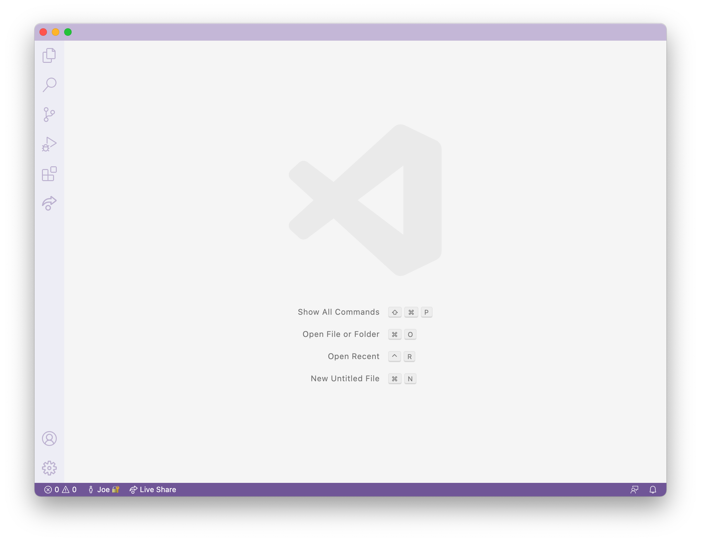
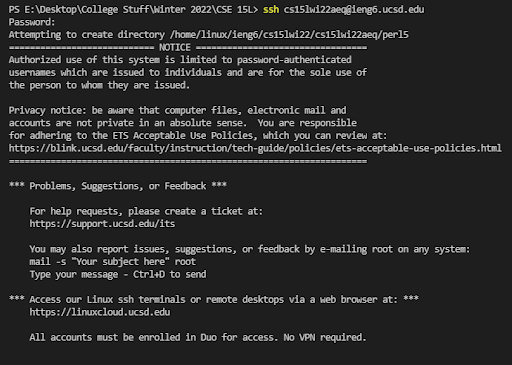
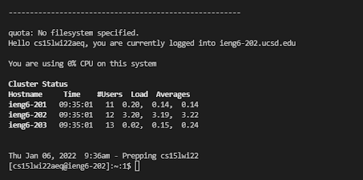
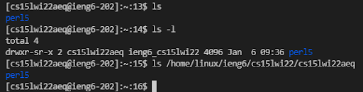
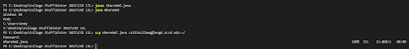
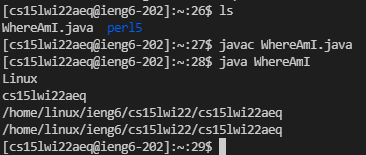
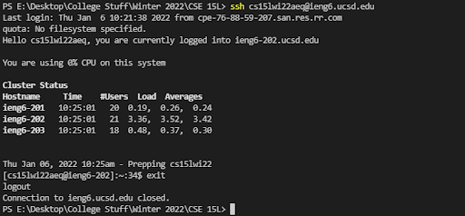

# How to log into ieng6 server
Procedure is in reference to: [https://ucsd-cse15l-w22.github.io/week/week1/](https://ucsd-cse15l-w22.github.io/week/week1/)

1) Download Visual Studio Code
    
Go to [this link](https://code.visualstudio.com/) to install VScode and follow the instructions there

 The window will look something similar to this (image taken from https://ucsd-cse15l-w22.github.io/week/week1/) 

2) Remotely Connecting

If you're on Windows:

[Install OpenSSH](https://docs.microsoft.com/en-us/windows-server/administration/openssh/openssh_install_firstuse) following the steps from the link

 For all:

Look for your course-specific account for CSE15L using the link: 
    
 https://sdacs.ucsd.edu/~icc/index.php

 In VScode, open the terminal by either pressing ctrl/command + shift + ` or using Terminal -> New Terminal from the menu at the top of VScode.

 Input $ ssh cs15lwi22zz@ieng6.ucsd.edu (zz should be replaced with the letters to your own account)

If it is the first time connecting to the ieng6 server, then you will get a prompt similar to this:

 `
The authenticity of host 'ieng6.ucsd.edu (128.54.70.227)' can't be established. RSA key fingerprint is SHA256:ksruYwhnYH+sySHnHAtLUHngrPEyZTDl/1x99wUQcec. Are you sure you want to continue connecting (yes/no/[fingerprint])?
`
    
It is expected to get this message for the first time. If it happens too often, it could mean someone is trying to control the connection. Refer to [this link](https://superuser.com/questions/421074/ssh-the-authenticity-of-host-host-cant-be-established/421084#421084) for a more descriptive answer.

Input the password for your account. The password is supposed to be hidden so nothing will show if you type your password. You should get a terminal that is similar to this:




The terminal is now connected to the server and you can run commands in the server.

3) Trying out commands

Run some commands on the server and also on your client and look for similarities and differences. You can create a new terminal to run commands on your client or run `exit` in the terminal or ctrl + D to logout of the server.

Some commands that you can use are:
 * cd [~]
 * ls [-lat, -a, `<directory>`]
 * pwd
 * cp
 * cat

here's a reference on what it looks like: 



4) Moving files over SSH

In order to move files over to the server, we utilize the `scp` command.

Start by creating a java file called WhereAmI.java with the following lines of code:
```
class WhereAmI {
    public static void main(String[] args) {
        System.out.println(System.getProperty("os.name"));
        System.out.println(System.getProperty("user.name"));
        System.out.println(System.getProperty("user.home"));
        System.out.println(System.getProperty("user.dir"));
    }
}
```
    
Compile it on the client using `javac WhereAmI.java` and run it with `java WhereAmI`

Then type in the following command **on your client**:

 `scp WhereAmI.java cs15lwi22zz@ieng6.ucsd.edu:~/`

You should be prompted for a password in the same manner as you login to the server.

Login to the server and use the `ls` command to see if your file is in the server.

 You can run the java file in the server using the terminal connected to the server similar to how you would run java files on your computer. Try it out and see what you get compiling then running WhereAmI.java on the server.
    
Here is a reference image to what the terminal would look like:



5) Setting up a SSH key

A password is always required every time you run `ssh` or `scp`. There is a way to avoid the repition and that's with a ssh key. The ssh key creates a public and private key where you copy the public key to a location in the server and the private key is kept in the client. The `ssh` command uses the keys to login instead of using a password.

In order to set up a ssh key, **on your client** run:
```
$ ssh cs15lwi22zz@ieng6.ucsd.edu
<Enter Password>
# now on server
$ mkdir .ssh
$ <logout>
# back on client
$ scp /Users/joe/.ssh/id_rsa.pub cs15lwi22@ieng6.ucsd.edu:~/.ssh/authorized_keys
# You use your username and the path you saw in the command above
```

    
If you're on Windows, refer to the ssh-add steps here: https://docs.microsoft.com/en-us/windows-server/administration/openssh/openssh_keymanagement#user-key-generation

Then copy the **public** key to the .ssh directory on the server:
```
$ ssh cs15lwi22zz@ieng6.ucsd.edu
<Enter Password>
 # now on server
$ mkdir .ssh
$ <logout>
# back on client
$ scp /Users/joe/.ssh/id_rsa.pub cs15lwi22@ieng6.ucsd.edu:~/.ssh/authorized_keys
# You use your username and the path you saw in the command above
```

You should be able to use `ssh` and `scp` without needing a password now. It should look like this:


## Extra Tips for running commands
* You can run commands from the server without needing to login to the server and then logout by putting the code you want to run in the server in quotes:
```
$ ssh cs15lwi22@ieng6.ucsd.edu "ls"
```
* You can use semicolons to run multiple commands at once in most terminals:
```
$ cp WhereAmI.java OtherMain.java; javac OtherMain.java; java WhereAmI
```
* The up-arrow key recalls the last command run
* The ctrl key (on Windows for the most part) can easily navigate and edit code more easily some of the functions include:
    * ctrl + arrow keys will move the typing bar to the next non-alphabetical or non-numerical character
    * ctrl + backspace will delete all characters until the next non-alphabetical or non-numerical character

Here's a link of shortcuts from Visual Studio Code on Windows:
[https://code.visualstudio.com/shortcuts/keyboard-shortcuts-windows.pdf](https://code.visualstudio.com/shortcuts/keyboard-shortcuts-windows.pdf)

        

    