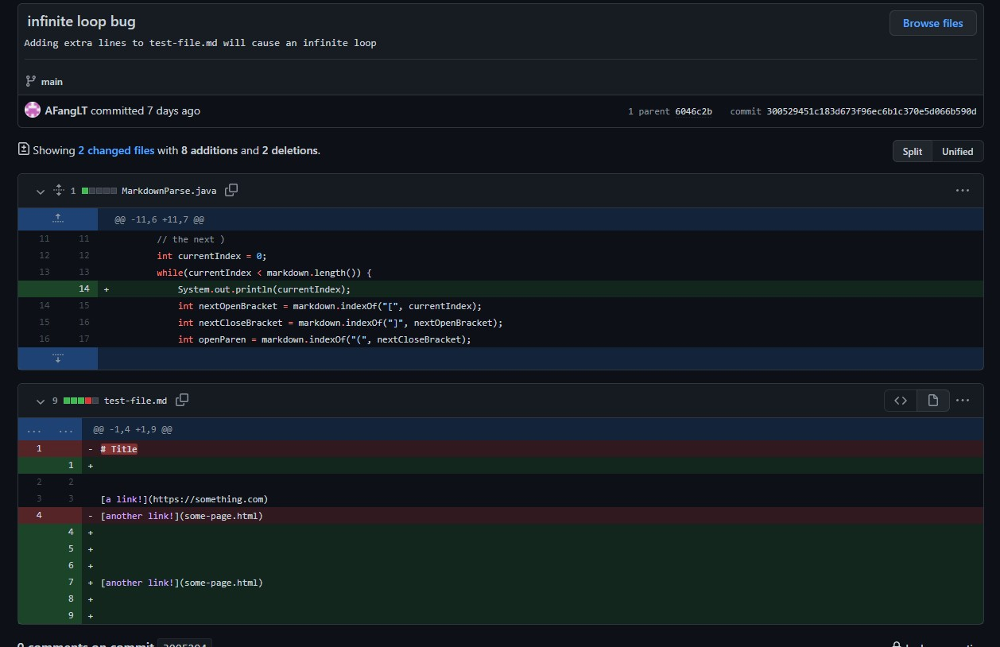
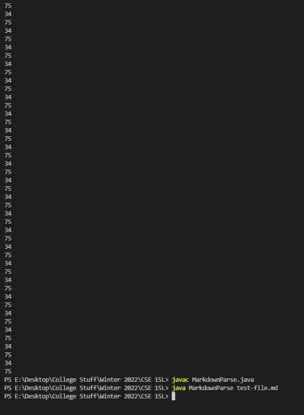
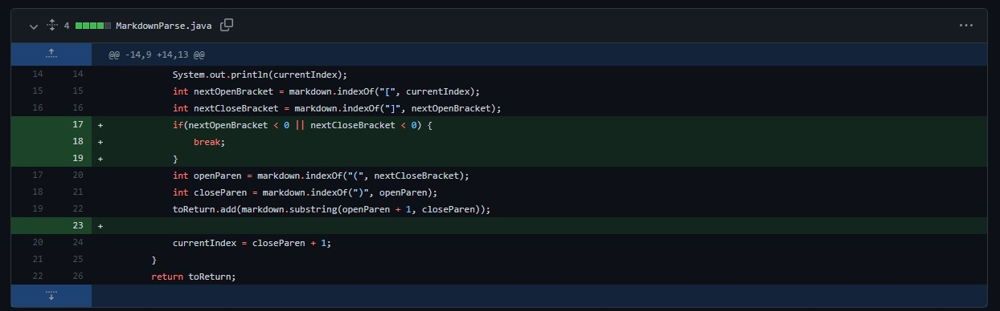
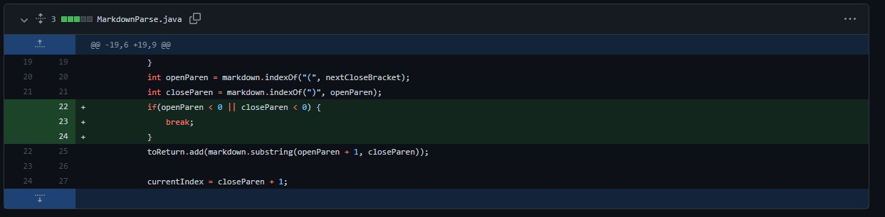
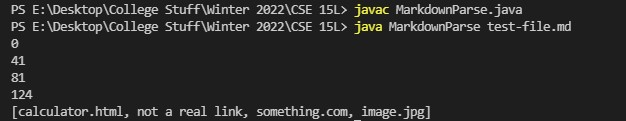
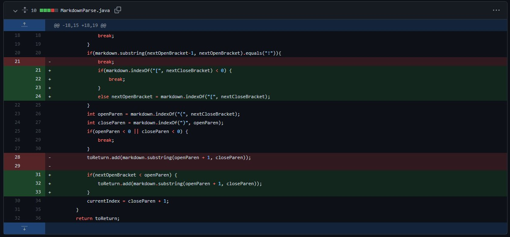
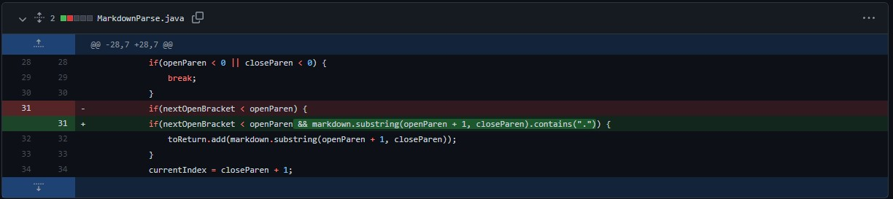

# **MarkdownParse Bugs/Issues**

These are some of the bugs/issues found in the java file given to us and the resolution to fix the issue.

These bugs can be found on [this link](https://github.com/AFangLT/markdown-parse/commits/main) from the commits on Jan 20, 2022. (Scroll down to the very first commits)

# Infinite Loop

[Link to Bug](https://github.com/AFangLT/markdown-parse/commit/300529451c183d673f96ec6b1c370e5d066b590d)

[Link to Solution](https://github.com/AFangLT/markdown-parse/commit/e874dfc967d28c1f51dce11c8be404344a823b98)

Adding a line at the end of the markdown file causes an infinite loop because the extra line will cause currentIndex to still be less than the length of the file. 

The int values will then be -1 because there are no brackets or parenthesis after the last link and thus, resets the current index back to the start (currentIndex + 1 = 0) thus causing an infinite loop.

Images below shows the changes that caused the infinite loop and the output in the terminal.



currentIndex is being outputted to show the infinite loop.



In order to fix the infinite loop bug, a condition is set to where if we don't find anymore brackets or parenthesis after the closed bracket (any of the int values will be -1), break the loop and return the list of links.





# Image Link

[Link to Bug](https://github.com/AFangLT/markdown-parse/commit/948dc7e605f2b1994860864ef644c6e56a36dd33)

[Link to Solution](https://github.com/AFangLT/markdown-parse/commit/c38c45862f7e2c89c43fbfef913c1c7f198e1671)

The code is intended to gather the links of the markdown file. However, image links will also be picked up because they have a similar format to a link.

Image below shows that the image.jpg file is being included in the list. The numbers are the values of the currentIndex when the loop runs again at the start. With the following markdownfile:

```
[where a link should go](calculator.html)

[put a faulty link](not a real link)

[real link after faulty](something.com)


```



**The issue with "not a real link" will be dealt in the section**

In order to resolve the issue with the image. In the markdown file, the difference between an image reference and a link is the image markdown contains an "!" before the open bracket. So setting a condition to check for the "!" can help resolve the issue. If there is one and there are still open brackets after the image file, continue the search from the closed bracket. Otherwise, break the loop.



# False Links

[Link to Bug](https://github.com/AFangLT/markdown-parse/commit/41e46ae8741171dba8cdd564082f73c3d58eab97)

[Link to Solution](https://github.com/AFangLT/markdown-parse/commit/080d4b3b115b8ac75ac6f90bafe71d89efb3f098)

As stated, the code will also catch items that aren't actually links. The output of the code and markdown file will be pasted here for reference.

## test-file
```
[where a link should go](calculator.html)

[put a faulty link](not a real link)

[real link after faulty](something.com)


```


In order to fix the issue, we set a condition before adding the text inbetween the parenthesis. The condition is if the text contains a period, then add the text in the list to return.



**This does NOT resolve ALL of the possible fake links. It only resolves the ones where period is not present.**
