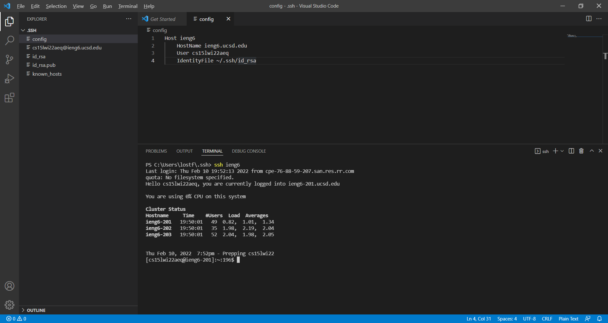
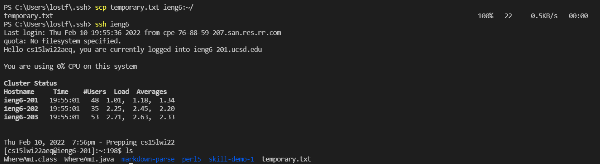

# Streamlining ssh Configuration

## 1. Setting up and Running the ssh command

The image below shows the directory to the .ssh folder on VScode. I created the config file with the following commands to be able to login to the ieng6 server by inputing `ssh ieng6` in the terminal.

The `scp` command can also use this shortcut of inputting "ieng6" instead of the course specific account. The image below shows me transferring temporary.txt to the ieng6 server using `scp temporary.txt ieng6:~/`. Logging into the ieng6 server and checking the directory in which the text file was transferred, the temporary.txt was successfully transferred to the server.

