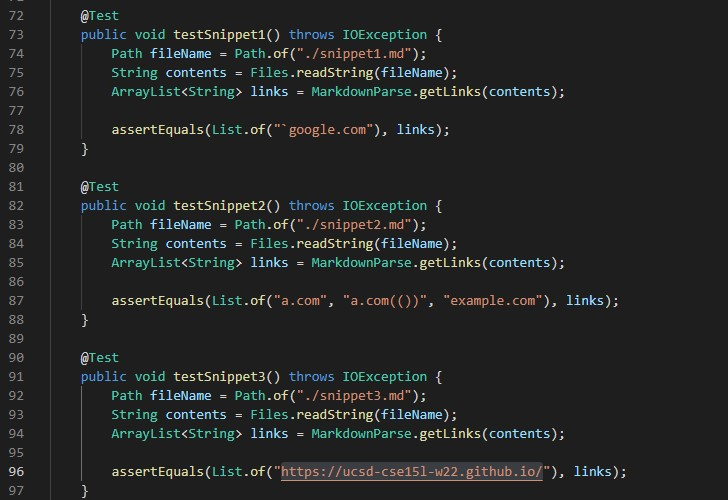
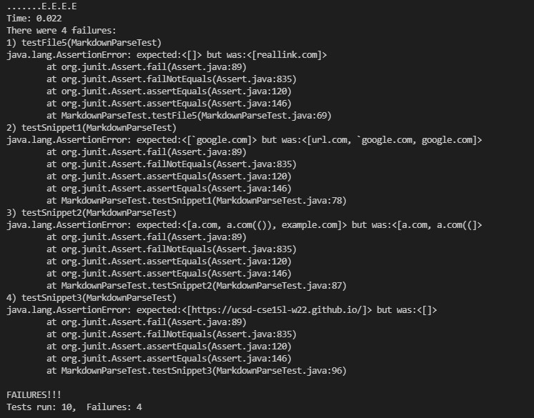
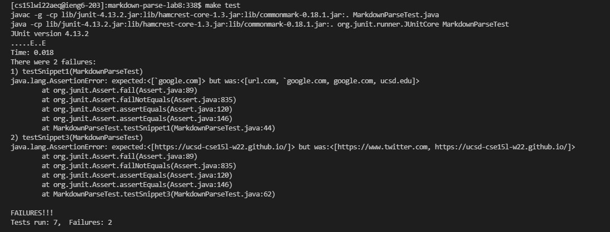

# Week 8 Lab Report

Link to my markdown-parse repository: [https://github.com/AFangLT/markdown-parse](https://github.com/AFangLT/markdown-parse)

## Expected Outputs

### Snippet 1:

```
`[a link`](url.com)

[another link](`google.com)`

[`cod[e`](google.com)

[`code]`](ucsd.edu)
```

Expected Output: [`google.com]

### Snippet 2:

```
[a [nested link](a.com)](b.com)

[a nested parenthesized url](a.com(()))

[some escaped \[ brackets \]](example.com)
```

Expected Output: [a.com, a.com(()), example.com]

### Snippet 3:

```
[this title text is really long and takes up more than 
one line

and has some line breaks](
    https://www.twitter.com
)

[this title text is really long and takes up more than 
one line](
    https://ucsd-cse15l-w22.github.io/
)


[this link doesn't have a closing parenthesis](github.com

And there's still some more text after that.

[this link doesn't have a closing parenthesis for a while](https://cse.ucsd.edu/


)

And then there's more text
```

Expected Output: [https://ucsd-cse15l-w22.github.io/]

## Implementation in MarkdownParseTest.java

Below is my implementation of how I test the snippets on my device.



## Running the tests

I ran the tests on the ieng6 servers. On my own MarkdownParse.java file, the tests failed. It expects more of the links that were invalid due to code blocks, new lines, and checking parenthesis. testFile5 is not involved with any of the snippets.



The test with the code reviewed during lab also failed but only on the first and third snippets.



## Answering Questions

1. Do you think there is a small (<10 lines) code change that will make your program work for snippet 1 and all related cases that use inline code with backticks? If yes, describe the code change. If not, describe why it would be a more involved change.

Yes, I can add extra conditions that would make the loop continue without adding anything by checking if the substring before, between, and/or after the brackets and parenthesis.

2. Do you think there is a small (<10 lines) code change that will make your program work for snippet 2 and all related cases that nest parentheses, brackets, and escaped brackets? If yes, describe the code change. If not, describe why it would be a more involved change.

No, just like the markdown-parse repository reviewed during lab, the helper method tracks the nested parenthesis in order to get everything inbetween the outer parenthesis, which can also be done with nested brackets. Checking for "\" is similar to checking if the link is an image which requires a singular condition.

3. Do you think there is a small (<10 lines) code change that will make your program work for snippet 3 and all related cases that have newlines in brackets and parentheses? If yes, describe the code change. If not, describe why it would be a more involved change.

Yes, similar to checking for backticks, I can also check if new lines are contained inbetween the substring of the brackets and parenthesis and continue the loop.