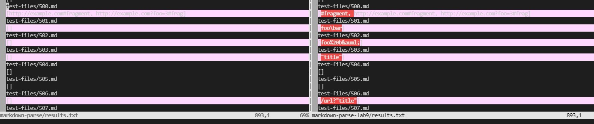

# My MarkdownParse vs Reviewed MarkdownParse

## How to compare

How I compared the two text files that were placed in their respective directory via `bash script.sh > results.txt` was using the `vimdiff` command. How `vimdiff` works here is that it takes 2 arguments that are separated by a space after the command and have them simultaneously viewed. 

In other words, inputing the command below where dir1 and dir2 are the directories to the files we want to view.

```
$ vimdiff dir1 dir2
```

In my case I used this command:

```
$ vimdiff markdown-parse/results.txt markdown-parse-lab9/results.txt
```

The window looks like the image below where any differences in the line are marked in pink and the difference within the line are marked in red.


## Differences in Implementation

The two differences in implementation I will compare are the contents in 577.md and 500.md

### 577.md

Contents:

```
![foo *bar*]

[foo *bar*]: train.jpg "train & tracks"
```

According to the commonmark output, it should output an image and therefore should not extract any links.


Based on the difference found, my implementation was correct while the reviewed one is incorrect because `train.jpg` was outputted in the reviewed implementation.


Below is the image of the reviewed MarkdownParse.java. The bug in the code is that the getLinks method does not check if the open bracket was followed by an "!" which means an image link instead of a link.


### 500.md

Contents:

```
[link](#fragment)

[link](http://example.com#fragment)

[link](http://example.com?foo=3#frag)
```

Based on the commonmark output below, all of the link text will lead to the directory but the first one does not have the format of the link.


Based on the outputs of the two implementations, my implementation did not add the link that leads to "#fragment" while the reviewed implementation did.



Once again with the reviewed implementation below, there is no check for whether or not the contents between the parenthesis consists the format of a link (Ex: ending with .com or .org)


